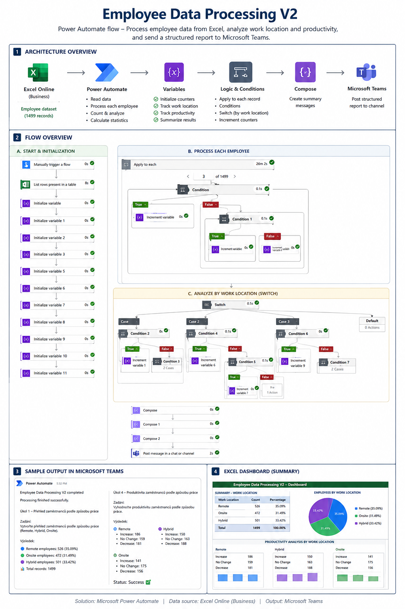

# 📊 Employee Data Analysis & Microsoft 365 Automation

  <strong>Excel • Power BI • SharePoint • Power Automate • Microsoft Teams</strong>

---

## 👩‍💻 About This Project / O tomto projektu

| 🇬🇧 English | 🇨🇿 Česky |
|:---|:---|
| I am a junior learning Microsoft 365, Power Platform and data processing through practical projects. | Jsem junior, který se učí Microsoft 365, Power Platform a zpracování dat prostřednictvím praktických projektů. |
| This project originally started as an Excel assignment created to verify my ability to work with employee data, PivotTables, PivotCharts and Slicers. | Tento projekt původně vznikl jako excelové zadání, jehož cílem bylo ověřit mou schopnost pracovat s daty zaměstnanců, kontingenčními tabulkami, kontingenčními grafy a průřezy. |
| After completing the required Excel analysis, I decided to extend the project with Power BI and Microsoft 365 services. | Po dokončení požadované analýzy v Excelu jsem se rozhodla projekt rozšířit o Power BI a služby Microsoft 365. |
| I use AI tools such as Microsoft Copilot, ChatGPT and Gemini as learning assistants. They help me explore options, understand errors and compare possible solutions. | Při učení využívám nástroje AI, například Microsoft Copilot, ChatGPT a Gemini. Pomáhají mi hledat možnosti, porozumět chybám a porovnávat různá řešení. |
| I decide the project direction, build the solution, test every version and verify the final results myself. | Směr projektu určuji sama, řešení sama vytvářím, jednotlivé verze testuji a výsledky kontroluji. |

---

## 📌 Project Overview / Přehled projektu

| 🇬🇧 English | 🇨🇿 Česky |
|:---|:---|
| The project demonstrates an end-to-end employee data analysis and automation solution built with Microsoft technologies. | Projekt představuje ucelené řešení pro analýzu dat zaměstnanců a automatizaci vytvořené pomocí technologií Microsoftu. |
| The anonymized dataset contains **1,499 employee records**. | Anonymizovaná datová sada obsahuje **1 499 záznamů zaměstnanců**. |
| I first analyzed the data in Microsoft Excel and created PivotTables, PivotCharts, Slicers and an interactive dashboard. | Data jsem nejdříve analyzovala v Microsoft Excelu a vytvořila kontingenční tabulky, kontingenční grafy, průřezy a interaktivní dashboard. |
| I then recreated selected reports in Power BI Desktop and added interactive filtering and visualizations. | Následně jsem vybrané analýzy vytvořila také v Power BI Desktop a doplnila interaktivní filtrování a vizualizace. |
| Finally, I extended the project with SharePoint, Power Automate and Microsoft Teams to automate selected analytical tasks and deliver the results automatically. | Nakonec jsem projekt rozšířila o SharePoint, Power Automate a Microsoft Teams, abych automatizovala vybrané analytické úlohy a automaticky doručila výsledky. |

---

## 📝 Original Assignment / Původní zadání

| 🇬🇧 English | 🇨🇿 Česky |
|:---|:---|
| The original assignment focused on employee data analysis in Microsoft Excel. | Původní zadání bylo zaměřeno na analýzu dat zaměstnanců v Microsoft Excelu. |
| The goal was to demonstrate practical work with data, PivotTables, PivotCharts and interactive Slicers. | Cílem bylo ukázat praktickou práci s daty, kontingenčními tabulkami, kontingenčními grafy a interaktivními průřezy. |
| The assignment included several analytical questions related to work location, experience, satisfaction, stress, productivity and region. | Zadání obsahovalo několik analytických otázek zaměřených na způsob práce, délku praxe, spokojenost, stres, produktivitu a region. |
| An interactive dashboard had to be created to allow filtering and comparison of the results. | Součástí zadání bylo vytvoření interaktivního dashboardu, který umožňuje filtrování a porovnávání výsledků. |

### Main analytical tasks / Hlavní analytické úkoly

| 🇬🇧 English | 🇨🇿 Česky |
|:---|:---|
| **Task 1:** Create an employee overview by work location: Remote, Hybrid and Onsite. | **Úkol 1:** Vytvořit přehled zaměstnanců podle způsobu práce: Remote, Hybrid a Onsite. |
| **Task 2:** Analyze the relationship between years of experience and satisfaction with remote work. | **Úkol 2:** Analyzovat vztah mezi délkou pracovních zkušeností a spokojeností s prací na dálku. |
| **Task 3:** Compare stress levels between individual job roles. | **Úkol 3:** Porovnat úroveň stresu mezi jednotlivými pracovními pozicemi. |
| **Task 4:** Evaluate employee productivity by work location. | **Úkol 4:** Vyhodnotit produktivitu zaměstnanců podle způsobu práce. |
| **Task 5:** Compare employee satisfaction across regions. | **Úkol 5:** Porovnat spokojenost zaměstnanců mezi jednotlivými regiony. |
| **Task 6:** Determine whether region influences stress or productivity. | **Úkol 6:** Zjistit, zda region ovlivňuje stres nebo produktivitu. |
| **Task 7:** Create an interactive dashboard with filters. | **Úkol 7:** Vytvořit interaktivní dashboard s filtry. |

---

## 🚀 My Project Extension / Moje rozšíření projektu

| 🇬🇧 English | 🇨🇿 Česky |
|:---|:---|
| The original assignment required only Microsoft Excel. | Původní zadání vyžadovalo pouze práci v Microsoft Excelu. |
| After completing the Excel part, I decided to continue and build a wider Microsoft 365 portfolio project. | Po dokončení excelové části jsem se rozhodla pokračovat a vytvořit širší portfolio projekt v Microsoft 365. |
| I recreated selected analyses in Power BI Desktop. | Vybrané analýzy jsem vytvořila také v Power BI Desktop. |
| I stored the project files and source dataset in a SharePoint document library. | Projektové soubory a zdrojová data jsem uložila do knihovny dokumentů v SharePointu. |
| I created a Power Automate workflow that automatically processes the Excel data. | Vytvořila jsem Power Automate workflow, které automaticky zpracovává data z Excelu. |
| I connected the workflow to Microsoft Teams, where the final results are delivered automatically. | Workflow jsem propojila s Microsoft Teams, kam jsou automaticky odesílány výsledky. |
| This extension was my own learning initiative and was not part of the original Excel assignment. | Toto rozšíření vzniklo z mé vlastní iniciativy a nebylo součástí původního excelového zadání. |

---

## 🔄 Solution Workflow / Průběh řešení

| 🇬🇧 English | 🇨🇿 Česky |
|:---|:---|
| **Step 1 – Source Data:** The employee dataset is stored in Excel in a SharePoint document library. | **Krok 1 – Zdrojová data:** Datová sada zaměstnanců je uložena v Excelu v knihovně dokumentů SharePointu. |
| **Step 2 – Excel Analysis:** The data is analyzed using PivotTables, PivotCharts, Slicers and an interactive dashboard. | **Krok 2 – Analýza v Excelu:** Data jsou analyzována pomocí kontingenčních tabulek, grafů, průřezů a interaktivního dashboardu. |
| **Step 3 – Power BI:** Selected reports are recreated in Power BI Desktop with interactive visuals and filtering. | **Krok 3 – Power BI:** Vybrané reporty jsou vytvořeny v Power BI Desktop s interaktivními vizualizacemi a filtrováním. |
| **Step 4 – Power Automate:** The workflow reads and processes all employee records from Excel. | **Krok 4 – Power Automate:** Workflow načte a zpracuje všechny záznamy zaměstnanců z Excelu. |
| **Step 5 – Microsoft Teams:** The final analytical summary is automatically delivered to Microsoft Teams. | **Krok 5 – Microsoft Teams:** Výsledný analytický souhrn je automaticky odeslán do Microsoft Teams. |
| **Step 6 – Validation:** The automated output is compared with the Excel PivotTables and dashboard. | **Krok 6 – Ověření:** Automatizovaný výstup je porovnán s kontingenčními tabulkami a dashboardem v Excelu. |

---

## 📊 Excel Analysis / Analýza v Excelu

| 🇬🇧 English | 🇨🇿 Česky |
|:---|:---|
| I worked with the complete employee dataset containing 1,499 records. | Pracovala jsem s kompletní datovou sadou obsahující 1 499 záznamů. |
| I created PivotTables for the individual analytical tasks. | Pro jednotlivé analytické úkoly jsem vytvořila kontingenční tabulky. |
| I created PivotCharts to make the results easier to understand. | Pro lepší přehlednost výsledků jsem vytvořila kontingenční grafy. |
| I added Slicers for filtering by work location, gender, region, job role, industry and years of experience. | Přidala jsem průřezy pro filtrování podle způsobu práce, pohlaví, regionu, pracovní pozice, odvětví a délky praxe. |
| I connected the analytical outputs into an interactive Excel dashboard. | Analytické výstupy jsem propojila do interaktivního dashboardu v Excelu. |

---

## 📈 Power BI Extension / Rozšíření v Power BI

| 🇬🇧 English | 🇨🇿 Česky |
|:---|:---|
| I used the same employee dataset to practice reporting in Power BI. | Stejnou datovou sadu zaměstnanců jsem využila k procvičení reportingu v Power BI. |
| The required functionality was not available to me in the Power BI web environment. | Potřebné funkce nebyly v mém prostředí dostupné ve webové verzi Power BI. |
| I therefore used Power BI Desktop to create the reports. | Proto jsem pro vytvoření reportů použila Power BI Desktop. |
| I created interactive visualizations, charts and Slicers. | Vytvořila jsem interaktivní vizualizace, grafy a průřezy. |
| I tested how filtering one visual influences the other parts of the report. | Vyzkoušela jsem si, jak filtrování jedné vizualizace ovlivňuje další části reportu. |

---

## ⚙️ Power Automate Workflow / Workflow v Power Automate

| 🇬🇧 English | 🇨🇿 Česky |
|:---|:---|
| The Power Automate workflow was created as an additional automation layer over the original Excel assignment. | Power Automate workflow vzniklo jako další automatizační vrstva nad původním excelovým zadáním. |
| The workflow automatically processes **Task 1** and **Task 4**. | Workflow automaticky zpracovává **úkol 1** a **úkol 4**. |
| It reads all **1,499 records** from the Excel table stored in SharePoint. | Načte všech **1 499 záznamů** z excelové tabulky uložené v SharePointu. |
| It uses initialized variables to store employee counts and productivity results. | Pro ukládání počtů zaměstnanců a výsledků produktivity používá inicializované proměnné. |
| `Apply to each` processes every employee record individually. | `Apply to each` zpracovává jednotlivě každý záznam zaměstnance. |
| Conditions separate Remote, Hybrid and Onsite employees. | Podmínky rozdělují zaměstnance do skupin Remote, Hybrid a Onsite. |
| A Switch action evaluates productivity as Increase, No Change or Decrease. | Akce Switch vyhodnocuje produktivitu jako Increase, No Change nebo Decrease. |
| Compose actions calculate percentages for the individual work-location groups. | Akce Compose vypočítávají procenta pro jednotlivé způsoby práce. |
| The completed summary is automatically posted to Microsoft Teams. | Hotový souhrn je automaticky odeslán do Microsoft Teams. |

### Automated tasks / Automatizované úkoly

| 🇬🇧 English | 🇨🇿 Česky |
|:---|:---|
| **Task 1:** Count Remote, Hybrid and Onsite employees and calculate their percentage distribution. | **Úkol 1:** Spočítat zaměstnance v režimu Remote, Hybrid a Onsite a vypočítat jejich procentuální zastoupení. |
| **Task 4:** Evaluate Increase, No Change and Decrease in productivity for Remote, Hybrid and Onsite employees. | **Úkol 4:** Vyhodnotit Increase, No Change a Decrease produktivity u zaměstnanců v režimu Remote, Hybrid a Onsite. |

### Workflow components / Použité prvky workflow

| 🇬🇧 English | 🇨🇿 Česky |
|:---|:---|
| Manual trigger | Ruční spuštění |
| Excel Online – List rows present in a table | Excel Online – načtení řádků z tabulky |
| Initialize variable | Inicializace proměnných |
| Apply to each | Zpracování každého záznamu |
| Conditions | Podmínky |
| Switch | Větvení pomocí Switch |
| Increment variable | Navyšování hodnot proměnných |
| Compose | Výpočet a příprava výsledků |
| Microsoft Teams – Post message | Odeslání zprávy do Microsoft Teams |

---

## ✅ Project Results / Výsledky projektu

| 🇬🇧 English | 🇨🇿 Česky |
|:---|:---|
| **1,499 employee records** were processed successfully. | Úspěšně bylo zpracováno **1 499 záznamů zaměstnanců**. |
| Excel PivotTables, PivotCharts and an interactive dashboard were completed. | Byly dokončeny kontingenční tabulky, grafy a interaktivní dashboard v Excelu. |
| Interactive reports were created in Power BI Desktop. | V Power BI Desktop byly vytvořeny interaktivní reporty. |
| Power Automate successfully automated Task 1 and Task 4. | Power Automate úspěšně automatizoval úkol 1 a úkol 4. |
| Multiple successful runs were recorded in Run History. | V Run History bylo zaznamenáno několik úspěšných běhů. |
| The completed results were automatically delivered to Microsoft Teams. | Hotové výsledky byly automaticky odeslány do Microsoft Teams. |
| The Power Automate results matched the Excel analysis. | Výsledky z Power Automate se shodovaly s analýzou v Excelu. |

---

## 🛠 Challenges & Solutions / Problémy a řešení

### Challenge 1 – Duplicate Hybrid Count / Problém 1 – Duplicitní započítání Hybrid zaměstnanců

| 🇬🇧 English | 🇨🇿 Česky |
|:---|:---|
| During testing, I noticed that the Hybrid employee count was significantly higher than expected. | Během testování jsem si všimla, že počet zaměstnanců v režimu Hybrid byl výrazně vyšší, než měl být. |
| The workflow completed successfully, but the Microsoft Teams output showed an incorrect Hybrid count. | Workflow sice technicky proběhlo úspěšně, ale výstup v Microsoft Teams zobrazoval nesprávný počet Hybrid zaměstnanců. |
| I checked the workflow logic and discovered that `HybridCount` was being incremented twice. | Zkontrolovala jsem logiku workflow a zjistila, že se proměnná `HybridCount` navyšovala dvakrát. |
| An older `Increment variable` action remained in the main False branch, while another Hybrid increment was already present inside the nested Hybrid Condition. | Ve hlavní větvi False zůstala starší akce `Increment variable`, přestože další navyšování Hybrid již bylo uvnitř vnořené podmínky pro Hybrid. |
| I removed the unnecessary increment action, saved the workflow and ran another test. | Nadbytečnou akci pro navýšení proměnné jsem odstranila, workflow uložila a spustila nový test. |
| The corrected totals matched the Excel PivotTables and the Microsoft Teams output was correct. | Opravené součty odpovídaly kontingenčním tabulkám v Excelu a výstup v Microsoft Teams již byl správný. |

---

### Challenge 2 – Workflow Execution Time / Problém 2 – Doba běhu workflow

| 🇬🇧 English | 🇨🇿 Česky |
|:---|:---|
| I observed a significant difference in execution time between Task 1 and the expanded workflow containing Task 4. | Zaznamenala jsem výrazný rozdíl v době běhu mezi úkolem 1 a rozšířeným workflow obsahujícím úkol 4. |
| Task 1 completed in approximately 10 minutes because the flow mainly counted employees by work location. | Úkol 1 byl dokončen přibližně za 10 minut, protože workflow především počítalo zaměstnance podle způsobu práce. |
| After adding Task 4, the flow needed to evaluate productivity for every one of the 1,499 records using additional variables, Conditions and Switch actions. | Po přidání úkolu 4 bylo nutné u každého z 1 499 záznamů vyhodnotit produktivitu pomocí dalších proměnných, podmínek a akcí Switch. |
| The expanded workflow required more than 30 minutes to complete. | Rozšířené workflow potřebovalo k dokončení více než 30 minut. |
| Instead of stopping the process, I monitored Run History and waited for the execution to finish. | Místo zastavení procesu jsem sledovala Run History a počkala na dokončení běhu. |
| The run completed successfully and the results were delivered to Microsoft Teams. | Běh byl úspěšně dokončen a výsledky byly doručeny do Microsoft Teams. |

---

### Challenge 3 – Power BI Web Limitation / Problém 3 – Omezení Power BI Web

| 🇬🇧 English | 🇨🇿 Česky |
|:---|:---|
| I originally wanted to create the report using the Power BI web version. | Původně jsem chtěla vytvořit report pomocí webové verze Power BI. |
| The required report-building functionality was not available in my environment. | Potřebné funkce pro tvorbu reportu však nebyly v mém prostředí dostupné. |
| I switched to Power BI Desktop and completed the interactive reports, charts and Slicers there. | Přešla jsem proto na Power BI Desktop, kde jsem dokončila interaktivní reporty, grafy a průřezy. |

---

### Challenge 4 – Result Validation / Problém 4 – Ověření výsledků

| 🇬🇧 English | 🇨🇿 Česky |
|:---|:---|
| A successful technical run did not automatically guarantee that the calculated values were correct. | Úspěšný technický běh automaticky nezaručoval, že vypočítané hodnoty jsou správné. |
| I therefore checked the values delivered to Microsoft Teams and compared them with my Excel PivotTables and dashboard. | Proto jsem zkontrolovala hodnoty odeslané do Microsoft Teams a porovnala je s kontingenčními tabulkami a dashboardem v Excelu. |
| This comparison helped me discover the duplicate Hybrid count and later confirm that the corrected workflow produced accurate results. | Toto porovnání mi pomohlo odhalit duplicitní započítání Hybrid zaměstnanců a následně potvrdit, že opravené workflow vytváří správné výsledky. |

---

### Challenge 5 – Keeping a Working Version / Problém 5 – Zachování funkční verze

| 🇬🇧 English | 🇨🇿 Česky |
|:---|:---|
| I did not want to lose the already working version while extending the workflow. | Při rozšiřování workflow jsem nechtěla přijít o již funkční verzi. |
| I created a copy using Save As and continued development in Employee Data Processing V2. | Pomocí Save As jsem vytvořila kopii a pokračovala ve vývoji ve verzi Employee Data Processing V2. |
| The previous tested version remained available as a safe fallback. | Předchozí otestovaná verze zůstala dostupná jako bezpečná záloha. |
| I also disabled the older active flow to prevent duplicate Microsoft Teams messages. | Starší aktivní flow jsem zároveň vypnula, aby se zprávy do Microsoft Teams neposílaly dvakrát. |

---

## 📚 What I Learned / Co jsem se naučila

| 🇬🇧 English | 🇨🇿 Česky |
|:---|:---|
| How to analyze a larger dataset using Excel PivotTables and PivotCharts. | Jak analyzovat větší datovou sadu pomocí kontingenčních tabulek a grafů v Excelu. |
| How to create interactive dashboards with Slicers. | Jak vytvářet interaktivní dashboardy s průřezy. |
| How to build interactive reports in Power BI Desktop. | Jak vytvářet interaktivní reporty v Power BI Desktop. |
| How to organize project files and source data in SharePoint. | Jak organizovat projektové soubory a zdrojová data v SharePointu. |
| How to read Excel records using Power Automate. | Jak načítat záznamy z Excelu pomocí Power Automate. |
| How to use variables, Conditions, Apply to each and Switch actions. | Jak používat proměnné, podmínky, Apply to each a Switch. |
| How to calculate percentages and prepare a structured summary. | Jak vypočítat procenta a připravit strukturovaný souhrn. |
| How to send an automated report to Microsoft Teams. | Jak odeslat automatizovaný report do Microsoft Teams. |
| How to investigate a workflow that technically succeeded but produced incorrect data. | Jak analyzovat workflow, které technicky proběhlo úspěšně, ale vytvářelo nesprávná data. |
| How to test, troubleshoot, correct and validate an automated process. | Jak automatizovaný proces testovat, opravovat a ověřovat. |
| How to extend a working solution without rebuilding everything from the beginning. | Jak rozšířit funkční řešení bez nutnosti stavět vše znovu od začátku. |

---

## 🤖 AI-Assisted Learning / Učení s podporou AI

| 🇬🇧 English | 🇨🇿 Česky |
|:---|:---|
| I use AI tools such as Microsoft Copilot, ChatGPT and Gemini as assistants during learning and troubleshooting. | Při učení a řešení problémů využívám nástroje AI, například Microsoft Copilot, ChatGPT a Gemini. |
| AI helps me understand unfamiliar functions, compare possible approaches and reduce unnecessary trial and error. | AI mi pomáhá pochopit neznámé funkce, porovnávat možné přístupy a omezit zbytečné pokusy a omyly. |
| I still build the workflow, configure every action, wait for the runs, inspect the outputs and correct the errors myself. | Samotné workflow ale vytvářím sama, nastavuji jednotlivé akce, čekám na dokončení běhů, kontroluji výstupy a opravuji chyby. |
| I am responsible for the direction of the project, the final design and the validation of the results. | Za směr projektu, finální návrh a ověření výsledků nesu odpovědnost já. |
| I treat AI as a practical learning assistant, not as a replacement for understanding or testing the solution. | AI vnímám jako praktického pomocníka při učení, ne jako náhradu za pochopení nebo testování řešení. |

---

## 🧰 Technologies Used / Použité technologie

| 🇬🇧 English | 🇨🇿 Česky |
|:---|:---|
| Microsoft Excel | Microsoft Excel |
| PivotTables | Kontingenční tabulky |
| PivotCharts | Kontingenční grafy |
| Slicers | Průřezy |
| Power BI Desktop | Power BI Desktop |
| SharePoint Online | SharePoint Online |
| Power Automate Cloud | Power Automate Cloud |
| Microsoft Teams | Microsoft Teams |
| Microsoft Copilot | Microsoft Copilot |
| ChatGPT | ChatGPT |
| Gemini | Gemini |

---

## 🖼️ Project Screenshots / Obrázky projektu

### 1. Complete project overview / Celkový přehled projektu

---

### 2. End-to-end project workflow / End-to-end průběh projektu

---

### 3. Real implementation details / Reálné detaily implementace

---

### 4. Excel, Power BI and Power Automate summary / Shrnutí Excelu, Power BI a Power Automate

---

## 🔮 Possible Future Improvements / Možná budoucí rozšíření

| 🇬🇧 English | 🇨🇿 Česky |
|:---|:---|
| Add an Office Script to automatically update or create Excel report elements. | Přidat Office Script pro automatickou aktualizaci nebo tvorbu částí excelového reportu. |
| Create additional automated analyses from the original assignment. | Automatizovat další analytické úlohy z původního zadání. |
| Create a simple Power Apps interface over the same data. | Vytvořit jednoduché rozhraní v Power Apps nad stejnými daty. |
| Improve workflow performance for larger datasets. | Optimalizovat výkon workflow pro větší datové sady. |
| Store workflow results in a SharePoint list for historical reporting. | Ukládat výsledky workflow do SharePoint seznamu pro historický reporting. |

---

## 💬 Final Note / Závěrečná poznámka

| 🇬🇧 English | 🇨🇿 Česky |
|:---|:---|
| This is a junior-level learning project created to demonstrate my practical progress with data analysis, Microsoft 365 and Power Platform automation. | Jedná se o vzdělávací projekt na juniorní úrovni, který ukazuje můj praktický posun v práci s daty, Microsoft 365 a automatizací v Power Platform. |
| The solution is not presented as an enterprise architecture. Its purpose is to show that I can work with a real assignment, extend it, test the solution, identify errors and deliver a working result. | Řešení neprezentuji jako enterprise architekturu. Jeho cílem je ukázat, že dokážu pracovat s reálným zadáním, rozšířit ho, řešení otestovat, odhalit chyby a dokončit funkční výsledek. |
| I continue learning and improving the project step by step. | Projekt dále postupně rozvíjím a učím se na něm nové dovednosti. |
